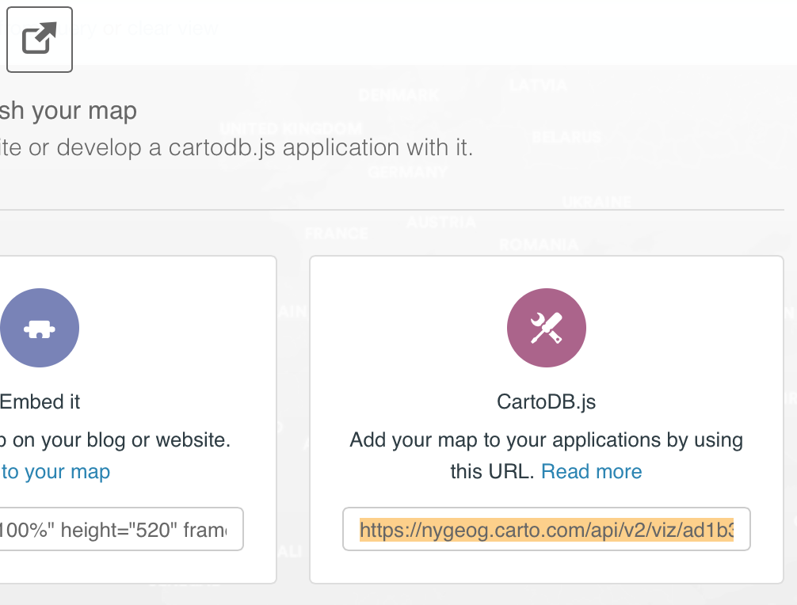
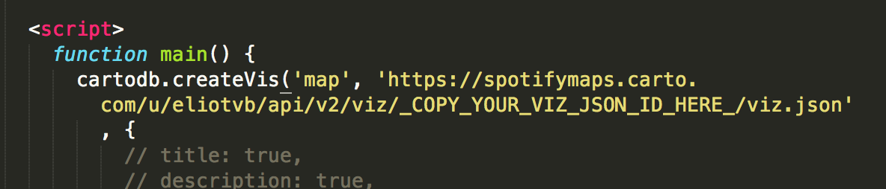
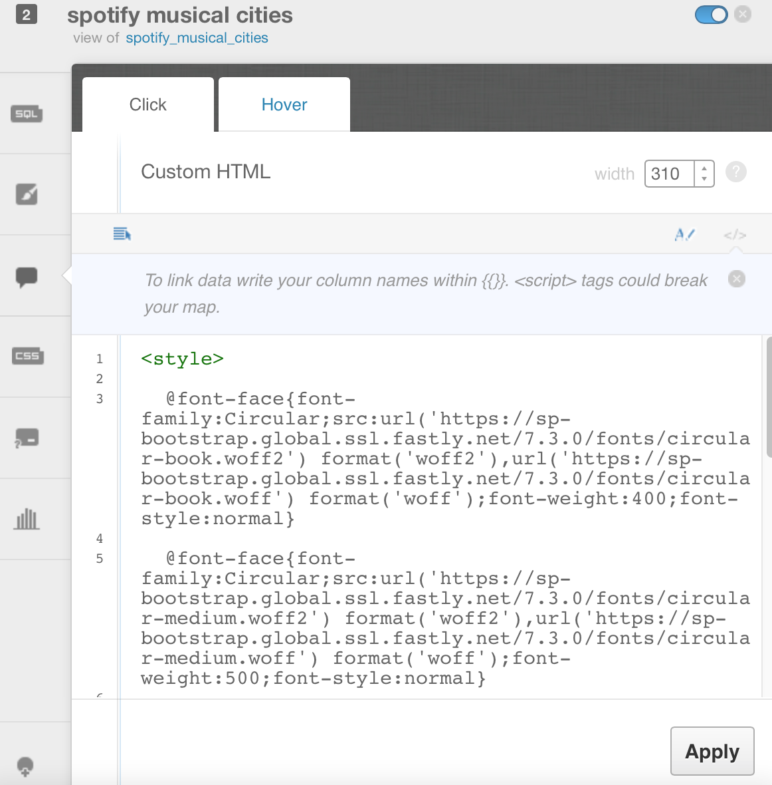
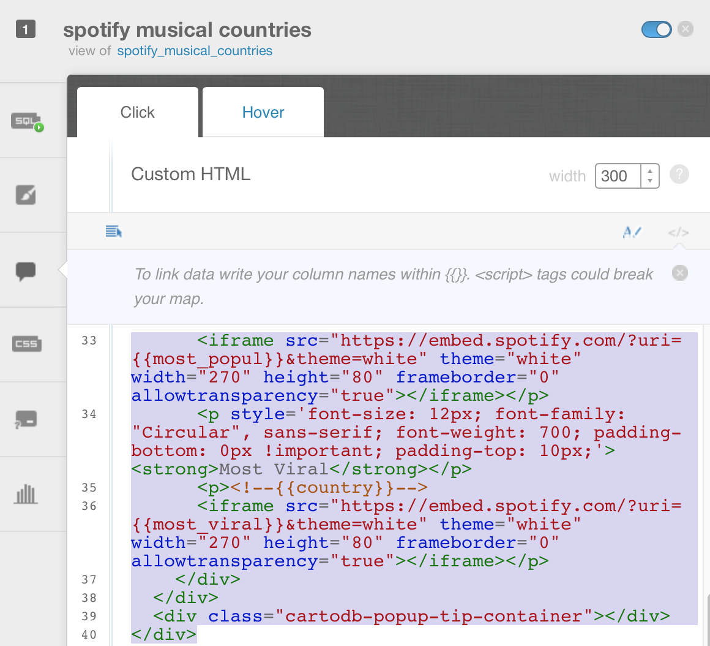

# Spotify | Carto Resources

Spotify | Carto Resources

Musical Cities Map:
[https://github.com/spotifymaps/spotifymaps.github.com/tree/master/musicalcities](https://github.com/spotifymaps/spotifymaps.github.com/tree/master/musicalcities)

Future Maps Template:
[https://github.com/spotifymaps/spotifymaps.github.com/tree/master/maptemplate](https://github.com/spotifymaps/spotifymaps.github.com/tree/master/maptemplate)

### Spotify | Carto Basemap URL:
	http://cartobase-{s}.global.ssl.fastly.net/spotify_dark/{z}/{x}/{y}.png?api_key=es5j1lspt00gaafhlaw0qa4mrijx61nm0bgnnhah

### iframe embed code example

	https://embed.spotify.com/?uri=spotify:user:thesoundsofspotify:playlist:01s3zfdCTwJ8yaeX5sbS7J&theme=white&width=285&height=360&frameborder=0&allowtransparency=true

To Reproduce the Spotify | Carto Map Template:

1. Get the `viz.json` from your map viz. Get it from here (copy that orange highlighted link): 

2. Put it here: 

### infoWindow Example for Cities

	  
	  
	  

	  <a href="#close" class="cartodb-popup-close-button close">x</a>
	  

	    

	      <!--<h4>description</h4>-->      
	
	      
	      
<strong>{{city}}</strong>

	       

	      <iframe src="{{link}}" theme="white" width="280" height="360" frameborder="0" allowtransparency="true"></iframe>

	
	    

	  

	  

	

	
### infoWindow example for Countries

	  
	  
	  

	  <a href="#close" class="cartodb-popup-close-button close">x</a>
	  

	    

	      
<strong>{{geounit}}</strong>

	      <!--<h4>description</h4>-->      
	<!----> 
	      <!---->
	      <!--
<strong>{{country}}</strong>
-->
	       <!--
-->
	      
<strong> Distinctive</strong>

	      
<!--Distinctive-->
				<iframe src="https://embed.spotify.com/?uri={{distinctiv}}&theme=white" theme="white" width="270" height="80" frameborder="0" allowtransparency="true"></iframe>

	      
<strong>Emerging</strong>

	      
<!--Emerging-->
	      <iframe src="https://embed.spotify.com/?uri={{emerging_t}}&theme=white" theme="white" width="270" height="80" frameborder="0" allowtransparency="true"></iframe>

	      
<strong>Most Popular</strong>

	      
<!--Most Popular-->
	      <iframe src="https://embed.spotify.com/?uri={{most_popul}}&theme=white" theme="white"  width="270" height="80" frameborder="0" allowtransparency="true"></iframe>

	      
<strong>Most Viral</strong>

	      
<!--{{country}}-->
	      <iframe src="https://embed.spotify.com/?uri={{most_viral}}&theme=white" theme="white" width="270" height="80" frameborder="0" allowtransparency="true"></iframe>
  
	    

	  

	  

	
	
	
	